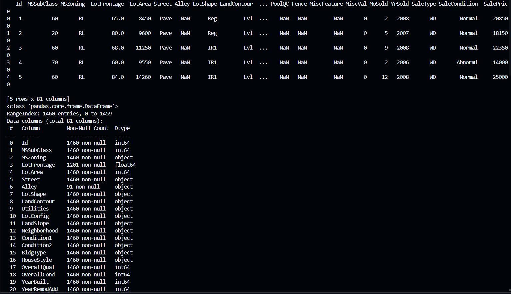
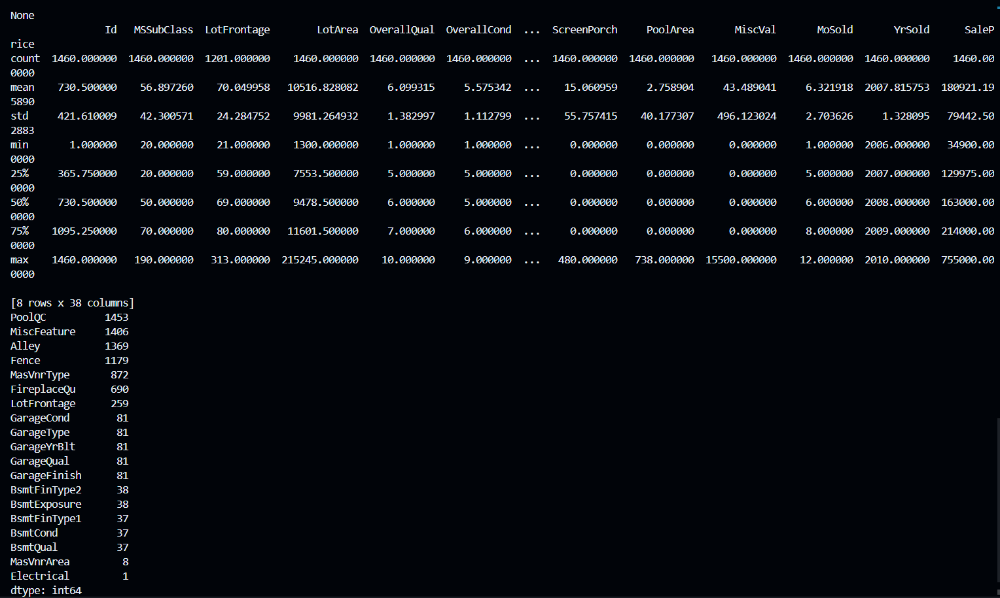

# Assignment-1: House Price Prediction using Linear Regression

## Objective
Develop a linear regression model to predict the price of a house based on its features, such as square footage, number of bedrooms and bathrooms, location, etc. Use the Zillow Zestimate Kaggle dataset to train and evaluate your model. Evaluate the performance of your model using metrics such as mean squared error and R-squared.

## Steps to Solve the Problem
1. **Data Loading and Inspection**: Load the dataset and perform a preliminary inspection to understand the data structure.
2. **Handling Missing Values**: Address missing values using median imputation for numerical columns and the most frequent value for categorical columns.
3. **Encoding Categorical Data**: Convert categorical features into numerical values using one-hot encoding.
4. **Splitting the Data**: Split the data into training and validation sets.
5. **Training the Linear Regression Model**: Train a linear regression model using a pipeline that preprocesses the data and fits the model.
6. **Model Evaluation**: Evaluate the model on the validation set using Mean Squared Error (MSE) and R-squared (R²) metrics.

## Dataset
The dataset is attached in the repository.

## Results
Include the performance metrics results as a snapshot in the GitHub repository.

### Output1

### Output2

